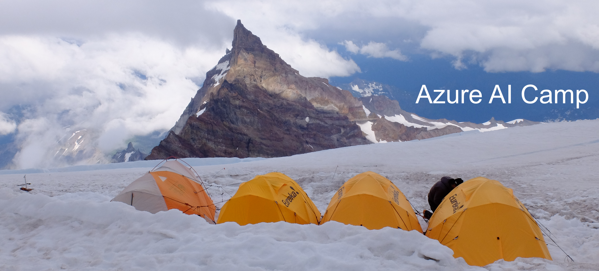

# Azure AI Camp 


Here, the ML practioner will learn how to use Azure ML, Databricks and other Microsoft AI technologies to unlock insights on big datasets and deploy AI services to the cloud and edge.  It is designed as a hands-on workshop experience, recommended in instructor-led format or on-demand learning by using the [documentation](#on-demand-learning) and resources provided for guidance.

## Prerequisites

1.  Python proficiency
2.  Azure Storage Account
3.  Access to an Azure Databricks Workspace (this is usually a shared resource for an org) and pre-provisioned cluster of type: 
  - Recommended SKU: `Standard_D16_v3`
  - Runtime `6.1 ML (includes Apache Spark 2.4.4, Scala 2.11)`.
4.  Access to an Azure ML Workspace (this is usually a shared resource for an org)  - <a href="https://docs.microsoft.com/en-us/azure/machine-learning/service/how-to-manage-workspace" target="blank_">Doc</a>
5.  Access to an Ubuntu Data Science Virtual Machine and Jupyterhub (this is usually a shared resource for an org) - <a href="https://docs.microsoft.com/en-us/azure/machine-learning/data-science-virtual-machine/dsvm-ubuntu-intro#jupyterhub-and-jupyterlab" target="_blank">Doc</a>
6.  Git installed locally
7.  Python 3.5+ installed locally (Anaconda or Miniconda recommended)
8.  Code editor like VSCode or PyCharm

## Agenda

### Day 1​
---
* (1)  AI at MS Overview​
    * (1.1) Cognitive Services overview
    * (1.2) Azure ML overview
    * _Break_
    * (1.3) Databricks with Azure ML overview
*  _Lunch_
* (2)  Auto ML with Databricks
* (3)  Azure ML with Databricks and Spark ML
*  _Break_
* (4) Parallel and distributed training​

​
### Day 2​
---

* (1) Azure ML on Data Science Virtual Machine
    * (1.1) Azure ML with AML Compute for Image Classification
    * _Break_
    * (1.2) Real world example in VSCode
*  _Lunch_
* (2) Deploy an Azure ML model as an Edge Module
*  _Break_
* (3) QnA Sessions
* _Break_
* (4) Wrap-up and feedback

## Technologies

1. Azure Databricks
2. Azure ML
3. Azure Storage
4. IoT Edge
5. Data Science Virtual Machine

## Setup on day-of

1. Git clone repo:  `git clone https://github.com/michhar/Azure-AI-Camp.git`
2. Set up an Azure Storage container
3. Download Azure ML Workspace `config.json`

## On-demand learning

Browse through day 1 and day 2 folders, noting that there are individual `Readme.md` documents in each section.  The day 1 platform is an Azure Databricks Workspace and Day 2 is utilizing the same dataset for suspicious behavior, but further exploring the Azure ML Python SDK with Jupyter notebooks on an Azure Data Science Virtual Machine as the platform. 

For day 1, most of the hands-on work will be in the form of Databricks notebooks which are very similar to Jupyter notebooks, utilizing a cluster on an Azure Databricks Workspace (see Prerequisites section for cluster information).  The notebooks for day 1 are all stored as archives with the `.dbc` extension.  It is straightforward to import these notebooks into the Databricks workspace - instructions can also be found <a href="https://docs.databricks.com/notebooks/notebooks-manage.html#import-a-notebook" target="blank_">here</a> (import under workspace or individual user).

For day 2, most of the hands-on work will be in Jupyter notebooks run locally or on an Azure Data Science Virtual Machine.  Whether local or on the VM, the learner will need to set this up for themselves.  More information on provisioning the Ubuntu Data Science Virtual Machine can be found <a href="https://docs.microsoft.com/en-us/azure/machine-learning/data-science-virtual-machine/dsvm-ubuntu-intro" target="blank_">here</a> and using Jupyterhub in the section on that tool <a href="https://docs.microsoft.com/en-us/azure/machine-learning/data-science-virtual-machine/dsvm-ubuntu-intro#jupyterhub-and-jupyterlab" target="blank_">here</a>.

## Additional notes

In using and contributing to this repo, please adhere to <a href="https://opensource.microsoft.com/codeofconduct" target="_blank">Microsoft Open Source Code of Conduct</a>.

## Contributing

For contributing, guidelines may be found in [CONTRIBUTING.md](CONTRIBUTING.md).

## Repo structure

```
README.md
/day1
  Readme.md
  /1.2.AzureMLOverview
  /1.3.DatabricksAzureMLOverview
  /2.AutoMLDatabricks
  /3.AzureMLSparkMLDatabricks
  /4.ParallelDistributedTraining
/day2
  Readme.md
  /1.1.ImageClassificationAmlCompute
  /1.2.ReadWorldExampleYOLO
  /2.IoTEdgeModule
  /3.Bonus
/instructor
  Readme.md
```
